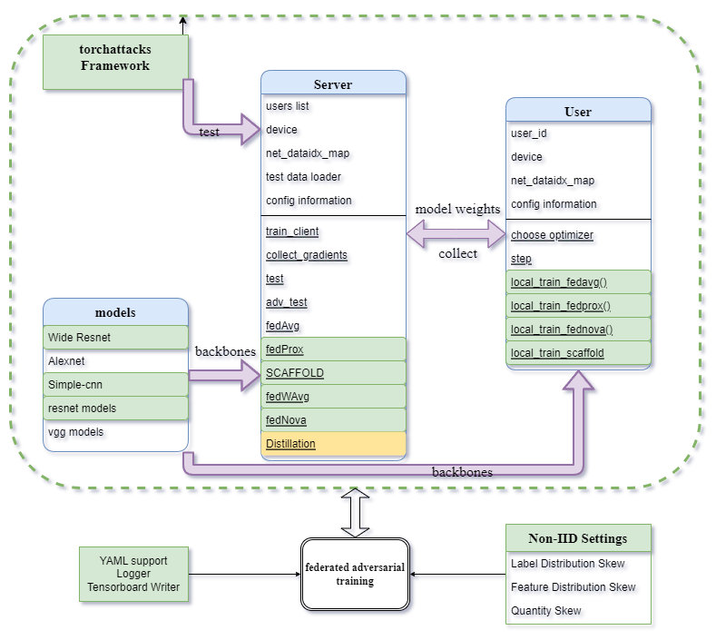

# Federate Adversarial Learning

## Overview
Federated Adversarial Training serves as a way to improve model adversarial robustness while preserving data privacy under federated learning settings. In general, data is biased and stored at remote clients, and clients will perform adversarial training on their skewed local data before uploading trained weights to one central server. Then, the server would aggregate weights from different clients and send back to clients. Clear as it seems, many problems need to addressed such as communication constraint, computational budget, robustness fairness and non-IID. Many methods have been proposed to overcome these issues. [FAT](https://arxiv.org/abs/2012.01791) is the first work to study this setting, [FedDynAT](https://arxiv.org/abs/2103.01319) reduces model shift through dynamic adjustment of local epochs in each communication round, [FedRBN](https://arxiv.org/abs/2106.10196) proposes an effective approach to propogate adversarial robustness among *non-iid* users, [GEAR](https://federated-learning.org/fl-aaai-2022/Papers/FL-AAAI-22_paper_34.pdf) and [CalFAT](https://arxiv.org/pdf/2205.14926.pdf) focus on the margin calibration of local class heterogeneity,  [Li et al.](https://arxiv.org/abs/2208.03635) gives a comprehensive convergence analysis. 

<p align = "center">

</p>
<p align = "center">
Fig.1 - FAL illustration
</p>

## Structure
To this end, this repository is a testing field where I've implemented **FAT, FedPGD, FedTRADES, FedMART, FedGAIRAT, CalFAT, Ensemble Distillation** and aggregation algorithms such as **FedAvg, FedProx, SCAFFOLD, FedNova, FedWAvg**. I haven't bothered to run a full test yet, so be careful and get a little improvised. My code is built on the top of [https://github.com/Xtra-Computing/NIID-Bench](https://github.com/Xtra-Computing/NIID-Bench) and [https://github.com/mukurgupta/federated-learning-with-adversarial-training](https://github.com/mukurgupta/federated-learning-with-adversarial-training). You could also treat this as unofficial implementation of:

* [FAT: Federated Adversarial Training](https://arxiv.org/abs/2012.01791)
* [Ensemble Distillation for Robust Model Fusion in Federated Learning](https://proceedings.neurips.cc/paper/2020/hash/18df51b97ccd68128e994804f3eccc87-Abstract.html)
* [CalFAT: Calibrated Federated Adversarial Training with Label Skewness](https://arxiv.org/abs/2205.14926)
* [Federated Adversarial Training with Transformers(FedWAvg)](https://arxiv.org/pdf/2206.02131.pdf)

General Code Structure:


## :rocket: Getting Started
First clone this repo, then run 
```python
pip install -r requiremenets.txt
```
I use [YACS](https://github.com/rbgirshick/yacs) for configuration file. Detailed explanation about parameters is in `config.py`
<details><summary>config.py</summary><p> 

```python3
"""
config file, details about yacs: https://github.com/rbgirshick/yacs
"""

from yacs.config import CfgNode as CN

_C = CN()
# set up random seed.
_C.SEED = 3047
# ["mnist", "fmnist", "femnist", "cifar10", "cifar100", "svhn"]
_C.DATASET = "mnist"
# ["simple-cnn", "moderate-cnn", "vggs", "resnet18","resnet50", "alexnet", "wideresnet", "small-cnn", "nin"]
_C.MODEL = "vgg16"
# data partition strategy, more details: https://github.com/Xtra-Computing/NIID-Bench
_C.PARTITION = "noniid-labeldir"
# concentration number for dirichlet distribution
_C.BETA = 0.5
# the frequency to save models
_C.CKPT = 100
# whether to assign helpers to clients during the training process. If assigned, you might want to tweak the loss both in Loss floder and local updates.
_C.HELP = False

# Data Path and Log Path
_C.PATH = CN()
_C.PATH.DATADIR = "../data/"
_C.PATH.DISTILLDATA = "../data/distillation_data"
_C.PATH.LOGDIR = "./logs/"

_C.SERVER = CN()
# Number of remote clients
_C.SERVER.CLIENTS = 10
# Communication rounds
_C.SERVER.COMMU_ROUND = 50
# Aggregation Algorithms: ["FedAvg", "FedProx", "FedNova", "SCAFFOLD", "FedWAvg"]
_C.SERVER.ALGO = "FedAvg"
# Fraction of clients used for updating each communication round(float, 1.0)
_C.SERVER.SAMPLE = 1.0
# Scale factor in FedWAvg algorithm
_C.SERVER.SCALE_FACTOR = 1.0
# the frequency to assign new helpers for each client
_C.SERVER.HELP_ROUND = 1
# learning rate for distillation process, we keep distillation optimizer the same as local trianing optimizer, neglect weight decay
_C.SERVER.LR = 0.0001


_C.USER = CN()
# Number of local training epochs
_C.USER.EPOCHS = 5
# Number of Training batch size
_C.USER.BATCH_SIZE = 128
# Number of learning rate
_C.USER.LR = 0.001
# optimizer, ["SGD", "Adam", "Adagrad"]
_C.USER.OPTIMIZER = "SGD"
# momentum in SGD
_C.USER.MOMENTUM = 0.9
# Whethter to perform adversarial training and test.
_C.USER.ADV = True
# weight decay in optimizer
_C.USER.WEIGHT_DECAY = 0.0
# fraction of local data to do adversarial training
_C.USER.RATIO = 1.0
# The proximal term parameter for FedProx
_C.USER.MU = 1.0
# the number of helpers (<= number of clients)
_C.USER.HELPERS = 5


def get_cfg_defaults():
    """Get a yacs CfgNode object with default values for my_project."""
    # Return a clone so that the defaults will not be altered
    # This is for the "local variable" use pattern
    return _C.clone()

```

</p></details>  

You can write new experiments configuration yaml in `./experiments`, and different experiments details:

<details><summary>To run CalFAT</summary><p>

```python3
python3 main.py ./experiments/align_with_calfat.yaml
```

</p></details>

<details><summary>If you want ensemble distillation for model fusion</summary><p>


This algorithm requires unlabeled dataset in the server. You can generate fake data with BigGAN as:
```python3
python3 generate_distill_data.py -s 33 -b 64 -nipc 128 -o ../data/distillation_data
```
or use existing datasets, such as stl10 for cifar10
</p></details>

<details><summary>To run with different local training loss</summary><p>

Many losses are provided in `./Loss`, you need to change loss term in local trianing such as replacing `calibrated_loss` with `trades_loss` in `local_train_fedavg`
</p></details>

By default, best robust accuracy model and final model will be saved. To attack trained models, the [torchattacks](https://github.com/Harry24k/adversarial-attacks-pytorch) framework is used:

```python3
python3 torchttacks_FAT.py -b 64 -d cifar10 -m simple-cnn -s 2022 --model-path /path/to/saved/model/
```

## :fire: Reommended Resources
* [A Complete List of All (arXiv) Adversarial Example Papers by **Nicholas Carlini**](https://nicholas.carlini.com/writing/2019/all-adversarial-example-papers.html)
* [Adversarial Robustness - Theory and Practice](https://adversarial-ml-tutorial.org/)
* [FederatedScope](https://federatedscope.io/)
* [Awesome Adversarial Machine Learning](https://github.com/yenchenlin/awesome-adversarial-machine-learning)
* [Awesome Federated Machine Learning](https://github.com/innovation-cat/Awesome-Federated-Machine-Learning)

# Reference
[1] C. Chen, Y. Liu, X. Ma, and L. Lyu, “CalFAT: Calibrated Federated Adversarial Training with Label Skewness.” arXiv, May 30, 2022. doi: 10.48550/arXiv.2205.14926.
[2] G. Zizzo, A. Rawat, M. Sinn, and B. Buesser, “FAT: Federated Adversarial Training.” arXiv, Dec. 03, 2020. doi: 10.48550/arXiv.2012.01791.
[3] Q. Li, Y. Diao, Q. Chen, and B. He, “Federated Learning on Non-IID Data Silos: An Experimental Study.” arXiv, Oct. 28, 2021. Accessed: Jul. 09, 2022. [Online]. Available: http://arxiv.org/abs/2102.02079
[4] T. Lin, L. Kong, S. U. Stich, and M. Jaggi, “Ensemble Distillation for Robust Model Fusion in Federated Learning.” arXiv, Mar. 27, 2021. doi: 10.48550/arXiv.2006.07242.
[5] H. Zhang, Y. Yu, J. Jiao, E. P. Xing, L. E. Ghaoui, and M. I. Jordan, “Theoretically Principled Trade-off between Robustness and Accuracy.” arXiv, Jun. 24, 2019. Accessed: Jun. 20, 2022. [Online]. Available: http://arxiv.org/abs/1901.08573


**[⬆ Return to top](#Overview)**